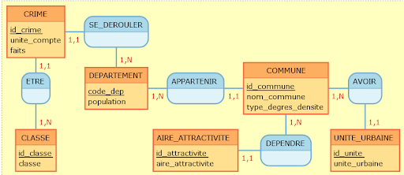
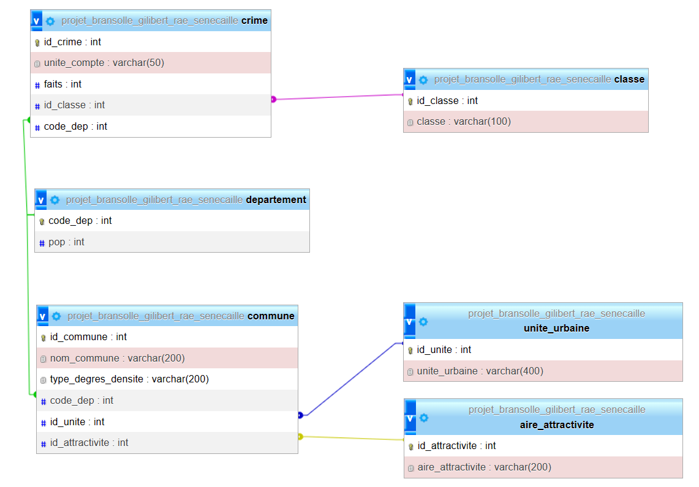
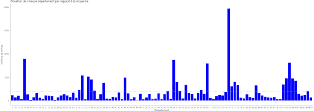

```r
library(DBI)

# Paramètres de connexion à la base de données
db_host <- "localhost"
db_port <- 3306
db_user <- "root"
db_password <- ""
db_name <- "projet_bransolle_gilibert_rae_senecaille"

# Connexion à la base de données
con <- dbConnect(RMySQL::MySQL(), 
                 host = db_host, 
                 port = db_port, 
                 user = db_user, 
                 password = db_password, 
                 dbname = db_name)
```


\newpage

Nous déclarons que ce rapport est le fruit de notre seul travail, à part
lorsque cela est indiqué explicitement.

Nous acceptons que la personne évaluant ce rapport puisse, pour les
besoins de cette évaluation:

-   la reproduire et en fournir une copie à un autre membre de
    l'université; et/ou,

-   en communiquer une copie à un service en ligne de détection de
    plagiat (qui pourra en retenir une copie pour les besoins
    d'évaluation future).
    
Nous certifions que nous avons lu et compris les règles ci-dessus.

En signant cette déclaration, nous acceptons ce qui précède. 

\
Signature: Line BRANSOLLE 22103700

Date: 04/05/2023

\
Signature: Rémy GILIBERT 22101487

Date: 04/05/2023

\
Signature: Jolhan RAE 22102934  

Date: 04/05/2023

\
Signature: Cassandra SENECAILLE 22100082

Date: 04/05/2023

\

Nos plus sincères remerciements vont à nos encadrants pédagogiques pour
les conseils avisés sur notre travail.\
04/05/2023.

\newpage


# Introduction {.label:s-intro}


## Introduction  

  En France, les crimes sont régulièrement enregistrés et analysés
par les autorités compétentes pour aider à comprendre les tendances et les
schémas de criminalité. En 2017, des données ont été recueillies sur les
crimes perpétrés dans chaque département en France. Dans ce travail,
nous allons examiner ces données afin de mieux comprendre la
distribution des crimes à travers les différents départements. Ainsi,
cette étude vise à répondre à la question de savoir :

**De quelle manière la richesse d'un département peut-elle influencer la
criminalité en 2017? **

Nous allons commencer notre analyse par cette brève introduction, puis nous 
continuerons sur l'explication de notre base de données et du modèle conceptuel
des données. Ensuite nous commencerons l'analyse sur les requêtes SQL, puis on
enchaînera sur l'analyse des données avec le langage R. Nous terminerons ce rapport
avec les difficultés que nous avons rencontré ainsi que par la conclusion générale 
de notre recherche. 


\bigskip

Les liens vers nos jeux de données :\
- [https://www.data.gouv.fr/fr/datasets/r/05cc86c4-b499-40c9-84cc-
fd24d92d4a45](https://www.data.gouv.fr/fr/datasets/r/05cc86c4-b499-40c9-84cc-%20fd24d92d4a45){.uri}\
- <https://www.data.gouv.fr/fr/datasets/r/acc332f6-92be-42af-9721-f3609bea8cfc>\

## Enjeux de ce thème 

  Nous avons choisi le sujet suivant : \"De quelle manière la 
richesse d'un département peut-elle influencer la criminalité en 2017?\ . 
Notre objectif sera donc d'interpréter et d'analyser les inégalités sociales en France  
dans l'optique de comprendre comment ces inégalités sont liées à la criminalité. 
Si on suppose que la richesse est un facteur important dans la criminalité, alors cela peut signifier que les
personnes vivant dans des zones défavorisées sont plus susceptibles de
commettre des crimes. Cette hypothèse pourrait également aider à établir des politiques
visant à réduire les inégalités sociales et économiques. 

De plus, étudier la corrélation entre les départements et la criminalité
en 2017 peut nous aider à comprendre les tendances actuelles et les
modèles de criminalité en France. Cela peut aider les autorités à
concentrer leurs ressources sur les zones où la criminalité est la plus
élevée et à adopter des approches ciblées pour la réduire.

Ainsi, notre recherche peut aider à établir des politiques
publiques plus efficaces, à réduire les inégalités sociales et
économiques et à améliorer notre compréhension de la criminalité en
France.

\newpage

## Descriptif de notre jeu de donnée  

  Pour notre projet, nous avons choisi les variables suivantes, présentent dans
les deux jeux de données :

-   classe : indicateur des crimes et délits;

-   Code.departement : le code officiel géographique du département;

-   unite.de.compte : unité de compte associé à cet indicateur
    (véhicule, infraction, victime, victime entendue);

-   faits : le nombre de faits de délinquance enregistrés;

-   Nom.de.la.commune : le libellé de la commune;

-   Typo.degre.densite : la typologie urbaine ou rurale de la commune
    définit à partir de la grille de densité communale;

-   TDUU2017 : la tranche détaillée d'unité urbaine à laquelle
    appartient la commune;

-   TDAAV2017 : la tranche détaillée d'aire d'attraction des villes à
    laquelle appartient la commune;

-   POP : population par départements.


# Base de données  


## Descriptif des tables  


  Nom de la colonne   Type de données                 Signification                     Caractéristiques
  ------------------- ------------------------------- --------------------------------- -------------------------------
  id_classe           Entier (integer)                Identifiant unique de la classe   Clé primaire, non nul, 
                                                                                        unique
  classe              chaîne de caractère (varchar)   type de crime et délits                   \-

  : Classe (11$\times$`<!-- -->`{=html}2)


La table Classe (2.1) regroupe deux types données, id_classe et classe. 

- id_classe est l'identifiant de la table, c'est une clé unique. 

- classe est de type varchar, elle nous informe sur le type de crime (cambriolage de logement, coups et blessures volontaires, vol de véhicule,... )


  Nom de la colonne   Type de données    Signification                     Caractéristiques
  ------------------- ------------------ --------------------------------- -------------------------------
  code_dep            Entier (integer)   Identifiant unique de la classe   Clé primaire, non nul, 
                                                                           unique
  POP                 Entier (integer)   population par département                   \-

  : departement (100$\times$`<!-- -->`{=html}2)
  
  
La table departement (2.2) regroupe deux types données, code_dep et pop

- code_dep est le code du département, c'est une clé primaire

- pop indique le nombre d'habitant de chaque département en 2017


\newpage

  Nom de la colonne   Type de données                 Signification                               Caractéristiques
  ------------------- ------------------------------- ------------------------------------------ -------------------------------
  id_attractivite     Entier (integer)                Identifiant unique de la classe             Clé primaire, non nul, 
                                                                                                  unique
  aire_attractivite   chaîne de caractère (varchar)   d'aire d'attraction des villes à                    \-
                                                      laquelle appartient la commune                      \-

  : aire_attractivite (17$\times$`<!-- -->`{=html}2)
  

La table aire_attractivite (2.3) regroupe deux types données: id_attractivite et aire_attractivite

- id_attractivité est une clé primaire

- aire_attractivité indique l'aire d'atractivité de la commune (aire de moins de 10 000 habitants, aire de 10 000 à moins de 20 000 habitants, ...)


Nom de la colonne   Type de données                 Signification                                    Caractéristiques
  ------------------- ------------------------------- ------------------------------------------------ -------------------------------
  id_unite            Entier (integer)                Identifiant unique de la classe                  Clé primaire, non nul, unique
  unite_urbaine       chaîne de caractère             unité urbaine à laquelle                                        \-
                      (varchar)                       appartient la commune

  : unite_urbaine (21$\times$`<!-- -->`{=html}2)

La table (2.4) unite_urbaine regroupe deux types de données: id_unite et unite_urbaine

- id_unite est une clé unique qui sert d'identifiant pour la table

- unite_urbaine indique l'unité urbaine de la commune (Commune hors unite urbaine, commune appartenant à l'unit urbaine de Paris,... )

\newpage

Nom de la colonne   Type de données       Signification                       Caractéristiques
  ------------------- --------------------- ---------------------------------- --------------------------------
  id_crime            Entier (integer)      Identifiant unique de la classe     Clé primaire, non nul, unique
  unite_compte        chaîne de caractère   unité de compte associé                     \-
                      (varchar)             à cette indicateur        
  faits               Entier (integer)      nombre de faits                             \-
  code_dep            Entier (integer)      code département                    clé                                                                                                                  étrangère vers la
                                                                                table \"departement\"
  id_classe           Entier (integer)      identifiant de la classe            clé étrangère vers la 
                                                                                table \"classe\"

  : crime (1089$\times$`<!-- -->`{=html}5)

La table crime (2.5) regroupe 5 types de données: id_crime, unite_compte, faits, code_dep et id_classe

- id_crime est une clé unique et primaire

- unite_compte correpond au type de crime (victime, infraction, victime entendue,...)

- faits indique le nombre de faits commis en 2017 pour la classe qui est indiqué

- code_dep est le département où les faits se sont déroulées, c'est la clé primaire de la table departement

- id_classe indique la classe concernée par les faits commis, c'est la clé primaire de la table classe


  Nom de la colonne     Type de données                 Signification                          Caractéristiques
  --------------------- ------------------------------- -------------------------------------- ---------------------------------
  id_commune            Entier (integer)                Identifiant unique                      Clé primaire, non nul,
                                                        de la classe                            unique
  nom_commune           chaîne de caractère             Nom de la commune                       
                        (varchar)                                                             
  type_degres_densite   chaîne de caractère             degrés de densité                       
                        (varchar)                       de la commune                           
  code_dep              Entier (integer)                code département                        clé étrangère vers 
                                                                                                la table            \"departement\"
  id_unite              Entier (integer)                identifiant de l'unité                  clé étrangère vers 
                                                        urbaine                                 la table \"unite_urbaine\"
  id_attractivite       Entier (integer)                identifiant de l'aire                   clé étrangère vers 
                                                        d'attractivité                          la table \"aire_attractivite\"
  
  : commune (4649$\times$`<!-- -->`{=html}6)

La table commune (2.6) regroupe 6 types de données: id_commune, nom_commune, type_degres_densite, code_dep, id_unite, id_attractivite. 

- id_commune est l'identifiant de la table, c'est une clé primaire

- nom_commune est le nom de la commune 

- type_degres_densite indique son degrés de densité (Rural à habitat dispersé, Bourgs ruraux, ...)

- code_dep indique le code du département de la commune, c'est la clé primaire de la table departement

- id_unite indique l'identifiant de l'unité urbaine, c'est la clé primaire de la table unite_urbaine

- id_attacrivite indique l'identifiant de l'aire d'attractivité, c'est la clé primaire de la table aire_attractivite


\newpage

## Modélisation  
### Modèle Conceptuel des Données  

Un modèle conceptuel de données (MCD) est une aide essentielle pour la compréhension de notre base de données. 
Il nous permet d'identifier les entités, les relations et les attributs de nos tables.

  On a pu visualiser notre MDC avec l'aide de l'outil [mocodo](https://www.mocodo.net/), qui est un logiciel 
d'aide à la modélisation de base de données. 
Il nous permettra d'identifier clairement les données qui seront utilisées pour notre projet, comme nous pouvons le voir sur la figure 2.1.

::: {#MCD}
{width="11cm" height="7cm"}
:::

Voici le MCD que l'on obtient sur PhpMyAdmin (figure 2.2)

::: {#MCD_wamp}
{width="11cm" height="7cm"}
:::
 
 \newpage

### Modèle Organisationnel  des Données  

La version écrite du MOD:   
 **unite_urbaine**(id_unite, unite_urvaine)  
 **aire_attractivite**(id_attractivite, aire_attractivite)  
 **departement**(code_dep, pop)    
 **commune**(id_commune, nom_commune,
type_degres_densite, code_dep, id_unite, id_attractivite)  
 **classe**(id_classe, classe)   
 **crime**(id_crime, unite_compte, faits,id_classe, code_dep)  


## Nettoyage des données  

  Avant d'importer nos données au format SQL, nous avons réuni
dans des classeurs Excel les données qui seront utiles pour notre analyse. Nous avons
relié nos classeurs en utilisant nos clés primaires et étrangères, ce
qui nous a permis de faire le lien entre nos futures tables SQL (voir MCD et MOD). Nous
avons nettoyé nos données de la manière suivante :

-   Jeu de données 1
    («donnee-dep-data.gouv-2021-geographie2022-produit-le 2022-07-27»):

    -   Suppression des caractères spéciaux

    -   Suppression des lignes vides

    -   Filtre par année, en prenant uniquement 2017

    -   Suppression des colonnes : **Code.region, milPOP, milLOG, LOG et
        tauxpourmille**

    -   Suppression des données de la Corse: 2A et 2B, car code.dep ne
        peut prendre que des INTEGER, et que les codes de la Corse
        regroupaient INTEGER et VARCHAR.

```{=html}
<!-- -->
```
-   Jeu de données 2
    («info-complements-data.gouv-2021-geographie2022-produit-le
    2022-07-27»):

    -   Suppression des caractères spéciaux

    -   Suppression des lignes vides

    -   Suppression des colonnes : **Code.region, Code.EPCI,
        Nature.EPCI, Code.arrondissement, Code.canton, ZE2020, UU2020,
        TUU2017, UUSTATUT2017, AAV2020, TAAV2017, CATEAAV2020, BV2012**

    -   Le **Code.region** nous a aidé à réduire le jeux de données pour
        ne garder que les communes des régions Occitanie(76) et
        Rhône-Alpes(84)

    -   Suppression des données liées à la Corse (2A et 2B)

\newpage

## Importation des données  

  Afin d'importer correctement nos tables dans PhpMyAdmin, nous 
avons utilisé le code SQL suivant. Cela nous a permis d'avoir directement les
clés primaires et étrangères de chaque table.

``` {.sql .numberLines linenos="true" frame="lines" framesep="2mm" fontsize="\\footnotesize"}
CREATE TABLE IF NOT EXISTS classe(
    id_classe int(11) NOT NULL,
    classe varchar(100) DEFAULT NULL,
    PRIMARY KEY(id_classe)
)ENGINE=InnoDB DEFAULT CHARSET=utf8;

CREATE TABLE IF NOT EXISTS departement(
    code_dep int(5) NOT NULL,
    pop int(10) NOT NULL,
    PRIMARY KEY(code_dep)
)ENGINE=InnoDB DEFAULT CHARSET=utf8;

CREATE TABLE IF NOT EXISTS unite_urbaine(
    id_unite int(10) NOT NULL,
    unite_urbaine varchar(200) DEFAULT NULL,
    PRIMARY KEY(id_unite)
)ENGINE=InnoDB DEFAULT CHARSET=utf8;

CREATE TABLE IF NOT EXISTS aire_attractivite(
    id_attractivite int(10) NOT NULL,
    aire_attractivite varchar(200) DEFAULT NULL,
    PRIMARY KEY(id_attractivite)
)ENGINE=InnoDB DEFAULT CHARSET=utf8;

CREATE TABLE IF NOT EXISTS commune(
    id_commune int(200) NOT NULL,
    nom_commune varchar(200) DEFAULT NULL,
    type_degres_densite varchar(200) DEFAULT NULL,
    code_dep int(5) NOT NULL,
    id_unite int(10) NOT NULL,
    id_attractivite int(10) NOT NULL,
    PRIMARY KEY (id_commune),
     FOREIGN KEY(code_dep) REFERENCES departement(code_dep),
     FOREIGN KEY(id_unite) REFERENCES unite_urbaine(id_unite),
     FOREIGN KEY(id_attractivite) REFERENCES aire_attractivite(id_attractivite)
)ENGINE=InnoDB DEFAULT CHARSET=utf8;

CREATE TABLE IF NOT EXISTS crime(
    id_crime int(10) NOT NULL,
    unite_compte varchar(50) DEFAULT NULL,
    faits int(200) NOT NULL,
    id_classe int(10) NOT NULL,
    code_dep int(5) NOT NULL,
    PRIMARY KEY (id_crime),
    FOREIGN KEY (id_classe) REFERENCES classe(id_classe),
    FOREIGN KEY (code_dep) REFERENCES departement(code_dep)
)ENGINE=InnoDB DEFAULT CHARSET=utf8; 
```

\newpage

Par la suite, nous avons importé les fichiers Excel dans un ordre
précis:

1.  classe
2.  attractivite
3.  unite_urbaine
4.  departement
5.  crime
6.  commune

Nous nous sommes rendu compte que le fichier \"unite_urbaine\" posait
problème, il ne voulait pas s'importer. Nous avons donc prit la décision d'importer directement 
les données sous forme de code SQL.

``` {.sql .numberLines linenos="true" frame="lines" framesep="2mm" fontsize="\\footnotesize"}
INSERT INTO unite_urbaine (id_unite,unite_urbaine)VALUES 
(1,'Commune hors unite urbaine'),
(2,'Commune appartenant a l unite urbaine de Paris'),
(3,'Commune appartenant a une unite urbaine de 10000 a 14999 habitants'),
(4,'Commune appartenant a une unite urbaine de 100000 a 149999 habitants'),
(5,'Commune appartenant a une unite urbaine de 15000 a 19999 habitants'),
(6,'Commune appartenant a une unite urbaine de 150000 a 199999 habitants'),
(7,'Commune appartenant a une unite urbaine de 2500 a 2999 habitants'),
(8,'Commune appartenant a une unite urbaine de 20000 a 24999 habitants'),
(9,'Commune appartenant a une unite urbaine de 200000 a 299999 habitants'),
(10,'Commune appartenant a une unite urbaine de 25000 a 29999 habitants'),
(11,'Commune appartenant a une unit urbaine de 3000 a 3999 habitants'),
(12,'Commune appartenant a une unite urbaine de 30000 a 39999 habitants'),
(13,'Commune appartenant a une unite urbaine de 300000 a 499999 habitants'),
(14,'Commune appartenant a une unite  urbaine de 400 a 4999 habitants'),
(15,'Commune appartenant a une unite urbaine de 40000 a 49999 habitants'),
(16,'Commune appartenant a une unite urbaine de 5000 a 6999 habitants'),
(17,'Commune appartenant a une unite urbaine de 50000 a 69999 habitants'),
(18,'Commune appartenant a une unite urbaine de 500000 a 1 999999 habitants'),
(19,'Commune appartenant a une unite urbaine de 7000 a 9999 habitants'),
(20,'Commune appartenant a une unite urbaine de 70000 a 99999 habitants'),
(21,'Commune appartenant a une unite urbaine de 70000 a 99999 habitants');
```

\newpage

## Requêtes SQL  

### Analyses sur les données :  

    - Donne le nombre total de crime en France en 2017:


```sql
SELECT SUM(crime.faits) AS total_crime_en_France_2017
FROM crime;
```


Table: 1 records

| total_crime_en_France_2017|
|--------------------------:|
|                    2106841|

    -   Donne le nombre de faits par départements:


```sql
SELECT departement.code_dep,  departement.pop, SUM(crime.faits) AS 'faits/departement'
FROM crime, departement 
WHERE crime.code_dep = departement.code_dep 
GROUP BY departement.code_dep
ORDER BY SUM(crime.faits) DESC;
```


Table: Displaying records 1 - 10

| code_dep|     pop| faits/departement|
|--------:|-------:|-----------------:|
|       75| 2187526|            216456|
|       13| 2024162|             98535|
|       59| 2604361|             95852|
|       93|  177689|             89068|
|       69| 1843319|             87612|
|       31| 1362672|             58936|
|       33| 1583384|             56530|
|       44| 1394909|             54132|
|       92|  157249|             52467|
|       94| 1609306|             52063|

D'après le tableau, on remarque que le département ayant le plus de délits est le département 75, Paris. 
Cela peut s'expliquer par une forte population, de plus, c'est la capitale du pays, on peut donc supposer que le résultat est proportionnel 
avec l'intéraction de la population. 
En deuxième position, nous retrouvons les Bouches-du-Rhône (13), où se situe la ville de Marseille, qui a une réputation de 'Capitale du Crime'.  

    -   Donne la moyenne du nombre de faits :


```sql
SELECT AVG(faits) AS 'Moyenne des faits de crime' 
FROM (
        SELECT SUM(faits) AS faits 
        FROM crime, departement 
        WHERE crime.code_dep=departement.code_dep 
        GROUP BY departement.code_dep ) AS departement_faits;
```


Table: 1 records

| Moyenne des faits de crime|
|--------------------------:|
|                   21281.22|


    -   Donne la médiane du nombre de faits:


```sql
        SELECT AVG(faits) AS mediane
FROM (
  SELECT SUM(crime.faits) AS faits, 
         ROW_NUMBER() OVER (ORDER BY SUM(crime.faits)) AS rang,
         COUNT(*) OVER () AS total_lignes
  FROM crime
  JOIN departement ON crime.code_dep = departement.code_dep
  GROUP BY departement.code_dep
  ORDER BY SUM(crime.faits)
) t
WHERE rang = CEILING(total_lignes / 2);
```


Table: 1 records

| mediane|
|-------:|
|   12403|

    -   Donne le taux pour mille par département:


```sql
        SELECT departement.code_dep, pop, SUM(crime.faits), (SUM(crime.faits)/departement.pop * 1000) 
        AS Taux_pour_mille 
        FROM departement
        JOIN crime ON departement.code_dep = crime.code_dep 
        JOIN classe ON crime.id_classe = classe.id_classe 
        GROUP BY departement.code_dep
        ORDER BY (SUM(crime.faits)/departement.pop * 1000)  DESC;
```


Table: Displaying records 1 - 10

| code_dep|     pop| SUM(crime.faits)| Taux_pour_mille|
|--------:|-------:|----------------:|---------------:|
|       93|  177689|            89068|        501.2578|
|       92|  157249|            52467|        333.6555|
|       38|  187187|            42190|        225.3896|
|       75| 2187526|           216456|         98.9501|
|      974|  372594|            22306|         59.8668|
|       13| 2024162|            98535|         48.6794|
|       69| 1843319|            87612|         47.5295|
|       34| 1144892|            49717|         43.4251|
|       31| 1362672|            58936|         43.2503|
|        6| 1083310|            43760|         40.3947|

Ici, on affiche le taux de crime pour mille habitants par département, cet indicateur apporte une analyse statistique prenant en compte le taux de crime et la population. 
On se rend compte que le département 93 (Seine-Saint-Denis) est dans le haut du tableau, suivit par les Hauts-de-Seine (92). Ces deux départements font partie de la banlieue de la métropole. 
On ne retrouve pas Paris dans le haut du classement, car il n'y a pas de proportionnalité entre la population et le nombre de crimes. En d'autres mots, il y a beaucoup plus d'habitants que de faits, comparé aux deux départements de sa banlieue. 

    -   Donne le nombre total de faits par unité de compte sur
        l'ensemble des départements (Permet de voir que crime est le
        plus représenté):


```sql
        SELECT crime.unite_compte ,SUM(crime.faits) AS Nombre_faits
        FROM crime JOIN departement ON crime.code_dep = departement.code_dep 
        GROUP BY (crime.unite_compte) 
        ORDER BY Nombre_faits DESC
```


Table: 4 records

|unite_compte     | Nombre_faits|
|:----------------|------------:|
|victime entendue |       717520|
|vehicule         |       528633|
|victime          |       506625|
|infraction       |       354063|

On observe que l'unité de compte ayant le plus de faits recensé est les victimes entendues, qui correspond aux plaintes déposées qui sont allées jusqu'au procès. 

    -   Donne le nombre total et le pourcentage des crimes de chaque
        classe:


```sql
SELECT classe.classe, SUM(crime.faits) AS total_crime, 
(SUM(crime.faits)*100 / SUM(SUM(crime.faits)) OVER()) AS pourcentage_crime 
FROM classe JOIN crime ON classe.id_classe = crime.id_classe 
GROUP BY classe.classe
ORDER BY (SUM(crime.faits)*100 / SUM(SUM(crime.faits)) OVER()) DESC;
```


Table: Displaying records 1 - 10

|classe                                        | total_crime| pourcentage_crime|
|:---------------------------------------------|-----------:|-----------------:|
|Vols sans violence contre des personnes       |      717520|           34.0567|
|Vols dans les vehicules                       |      271960|           12.9084|
|Cambriolages de logement                      |      253736|           12.0434|
|Coups et blessures volontaires                |      232570|           11.0388|
|Vols de vehicules                             |      155262|            7.3694|
|Autres coups et blessures volontaires         |      132436|            6.2860|
|Vols d'accessoires sur vehicules              |      101411|            4.8134|
|Coups et blessures volontaires intrafamiliaux |      100134|            4.7528|
|Vols violents sans arme                       |       90188|            4.2807|
|Violences sexuelles                           |       41485|            1.9691|

On remarque que la classe où il y a eu le plus de crimes est Vol sans violence contre des personnes, ce qui pourrait correspondre à des vols de biens (sac à main, téléphones, ...). Cette analyse correspond à la réalité. 

### Recherche de données  


    -   Donne l'identifiant, le nom et le type de degrés de densité de toutes les communes 
    du département '34':


```sql
 SELECT commune.id_commune,commune.nom_commune, commune.type_degres_densite 
 FROM crime, departement, commune 
 WHERE crime.code_dep=34 AND departement.code_dep=crime.code_dep 
 AND departement.code_dep = commune.code_dep;

```


Table: Displaying records 1 - 10

| id_commune|nom_commune  |type_degres_densite           |
|----------:|:------------|:-----------------------------|
|      34001|Abeilhan     |Bourgs ruraux                 |
|      34006|Aigne        |Rural a habitat disperse      |
|      34016|Aumelas      |Rural a habitat disperse      |
|      34018|Autignac     |Bourgs ruraux                 |
|      34019|Avene        |Rural a habitat tres disperse |
|      34020|Azillanet    |Rural a habitat disperse      |
|      34029|Belarga      |Bourgs ruraux                 |
|      34033|Boisseron    |Bourgs ruraux                 |
|      34039|Bouzigues    |Ceintures urbaines            |
|      34043|Buzignargues |Rural a habitat disperse      |

    -   Donne tous les départements ayant un nombre de crime supérieur à la moyenne:


```sql
  SELECT departement.code_dep, SUM(crime.faits) AS 'faits/departement' 
  FROM crime JOIN departement ON crime.code_dep = departement.code_dep
  GROUP BY departement.code_dep 
  HAVING SUM(crime.faits) > (
        SELECT AVG(somme_faits) 
        FROM (
          SELECT SUM(crime.faits) AS somme_faits
          FROM crime 
          GROUP BY code_dep) AS somme_faits_par_dep) 
  ORDER BY SUM(crime.faits) DESC;
        
```


Table: Displaying records 1 - 10

| code_dep| faits/departement|
|--------:|-----------------:|
|       75|            216456|
|       13|             98535|
|       59|             95852|
|       93|             89068|
|       69|             87612|
|       31|             58936|
|       33|             56530|
|       44|             54132|
|       92|             52467|
|       94|             52063|


```sql
 SELECT COUNT(*) AS 'nombre de départements concernés'
FROM (
    SELECT departement.code_dep, SUM(crime.faits) AS 'faits/departement'
    FROM crime JOIN departement ON crime.code_dep = departement.code_dep
    GROUP BY departement.code_dep
    HAVING SUM(crime.faits) > (
        SELECT AVG(somme_faits)
        FROM (
            SELECT SUM(crime.faits) AS somme_faits
            FROM crime
            GROUP BY code_dep
        ) AS somme_faits_par_dep
    )
    ORDER BY SUM(crime.faits) DESC
) AS departements_concernes;
        
```


Table: 1 records

| nombre de départements concernés|
|--------------------------------:|
|                               26|

On observe qu'il y a 26 départements qui ont des crimes au-dessus de la moyenne, que l'on a calculé dans la partie 'Analyse de données', sur les 99 départements. 

    -   Donne l'aire attractivité par commune :


```sql
SELECT commune.nom_commune, aire_attractivite.aire_attractivite 
FROM commune, aire_attractivite 
WHERE aire_attractivite.id_attractivite = commune.id_attractivite
```


Table: Displaying records 1 - 10

|nom_commune            |aire_attractivite                 |
|:----------------------|:---------------------------------|
|Apremont               |Aire de moins de 10 000 habitants |
|Beny                   |Aire de moins de 10 000 habitants |
|Bregnier-Cordon        |Aire de moins de 10 000 habitants |
|Champagne-en-Valromey  |Aire de moins de 10 000 habitants |
|Dompierre-sur-Veyle    |Aire de moins de 10 000 habitants |
|Rance                  |Aire de moins de 10 000 habitants |
|Sonthonnax-la-Montagne |Aire de moins de 10 000 habitants |
|Sulignat               |Aire de moins de 10 000 habitants |
|Ainay-le-Chateau       |Aire de moins de 10 000 habitants |
|Barberier              |Aire de moins de 10 000 habitants |

\newpage

    -   Donne le département, où le nombre de faits est < 100 et que
        unite_compte='vehicule':


```sql
SELECT crime.code_dep, classe.classe, SUM(crime.faits) AS total_faits 
FROM crime 
JOIN departement ON crime.code_dep = departement.code_dep 
JOIN classe ON classe.id_classe = crime.id_classe 
WHERE crime.unite_compte = 'véhicule' 
AND crime.faits < 100 
GROUP BY crime.code_dep, classe.classe
ORDER BY SUM(crime.faits) DESC;
```


Table: 7 records

| code_dep|classe                           | total_faits|
|--------:|:--------------------------------|-----------:|
|       48|Vols dans les vehicules          |          87|
|      976|Vols d'accessoires sur vehicules |          85|
|       23|Vols de vehicules                |          80|
|       15|Vols de vehicules                |          75|
|       15|Vols d'accessoires sur vehicules |          68|
|       48|Vols de vehicules                |          53|
|       48|Vols d'accessoires sur vehicules |          50|

On se rend compte que le département de La Lozère (48), regroupe 3 classes différentes (vols dans les véhicules, vol de véhicules et vols d'accessoires sur véhicules) qui ont moins de 100 faits. 

### Recherche de valeur aberrantes (Agrégats):  

    -   Donne les valeurs aberrantes du nombre de faits par départements (supérieur à 3 l'écart type) :


```sql
        SELECT crime.code_dep, SUM(faits) AS 'Total faits de crime'
        FROM crime,departement 
        WHERE crime.code_dep=departement.code_dep
        GROUP BY crime.code_dep 
        HAVING SUM(faits) > ( 
            SELECT AVG(faits) + (3 * STDDEV(faits)) 
            FROM ( 
                SELECT SUM(faits) AS faits 
                FROM crime,departement
                WHERE crime.code_dep=departement.code_dep 
                GROUP BY crime.code_dep ) AS departement_faits );
```


Table: 1 records

| code_dep| Total faits de crime|
|--------:|--------------------:|
|       75|               216456|

De la façon dont nous avons calculé ces valeurs, SQL ne trouve que la valeur aberrante la plus grande, qui se trouve être Paris (75). 

\newpage

    -   Combine les requêtes suivantes avec UNION ->  donne les départements qui ont
        plus de 90 000 faits et ceux qui ont moins de 2 000 faits :


```sql
SELECT departement.code_dep, SUM(crime.faits) AS 'faits/departement'
FROM crime 
JOIN departement ON crime.code_dep = departement.code_dep
GROUP BY departement.code_dep
HAVING SUM(crime.faits) > 90000 
UNION 
SELECT departement.code_dep, SUM(crime.faits) AS 'faits/departement' 
FROM crime JOIN departement ON crime.code_dep = departement.code_dep 
GROUP BY departement.code_dep
HAVING SUM(crime.faits) <2000  
ORDER BY `faits/departement` ASC;
```


Table: 6 records

| code_dep| faits/departement|
|--------:|-----------------:|
|       48|              1067|
|       23|              1629|
|       15|              1752|
|       59|             95852|
|       13|             98535|
|       75|            216456|

Lorsque l'on observe ce tableau, on se rend compte que les départements ayant le plus de délits recensés sont Paris (75), les Bouches-du-Rhônes(13) et le Nord (59), ces trois départements sont relativement peuplés. Or d'après le classement des départements français les plus riches, Paris est en première position, tandis que les Bouches-du-Rhône et le Nord sont respectivement en 29ème et 55ème positions. Ceci contredit notre analyse car ce ne sont pas les départements les plus riche. 
Les trois départements qui ont le moins de délits et de crimes sont la Lozère(48), la Creuse(23) et le Cantal(15), ils se situent dans des zones peu peuplées, et moins urbanisées que Paris par exemple. Ils se trouvent dans le bas du classement des départements les plus riche de France en 2017. Cela répond bien à la problématique. 

\bigskip  

--------------------------------------------------------------------------


```r
# Fermeture de la connexion
dbDisconnect(con)
```

```
## [1] TRUE
```


# Analyse des données  
## Techniques et outils utilisés pour l'analyse de données  

  Pour mener à bien une analyse de données, il existe différentes techniques et outils. Parmi les outils les plus couramment utilisés, on peut citer RStudio. C'est un environnement de développement intégré (IDE) pour le langage de programmation R, largement utilisé en analyse de données. Il propose de nombreuses bibliothèques et packages qui permettent de faire des graphiques, des statistiques descriptives, des analyses de corrélation, des modèles prédictifs, et bien plus encore. C'est pour cela que nous avons utilisé RStudio pour analyser nos données. Pour analyser nos données nous utiliserons dans un premier temps des graphiques et des statistiques descriptives pour explorer nos données, puis nous analyserons les corrélations entre les variables à l'aide de différents calculs (régression linéaire, analyse de variance, etc.). 

Pour notre projet, nous avons besoin de trois bibliothèques: 

```r
library(readxl)
library(ggplot2)
library(here)
```

```
## here() starts at C:/Users/33611/OneDrive/Documents/Rapport_G14
```

- readxl: ce package donne une fonction  qui nous permet de lire les données des fichiers Excel (read_excel()).

- here: ce package permet de créer des chemins relatifs à la racine du répertoire

- ggplot2: ce package nous permettra de faire des graphiques


Ensuite, avant de commencer notre analyse avec R, on importe les tableurs xlsx nécessaire avec la librairie here. 

```r
chemin_fichier <- here("DataFichiers", "Aire_Attractivite.xlsx")
Aire_Attractivite <- read_excel(chemin_fichier)

chemin_fichier <- here("DataFichiers", "Classe.xlsx")
Classe <- read_excel(chemin_fichier)

chemin_fichier <- here("DataFichiers", "commune.xlsx")
commune <- read_excel(chemin_fichier)

chemin_fichier <- here("DataFichiers", "Crimes.xlsx")
Crimes <- read_excel(chemin_fichier, col_types = c("numeric", "text", 
                                                   "numeric", "numeric", "numeric"))
chemin_fichier <- here("DataFichiers", "Departement.xlsx")
Departement <- read_excel(chemin_fichier)

chemin_fichier <- here("DataFichiers", "unite_urbaine.xlsx")
unite_urbaine <- read_excel(chemin_fichier, col_types = c("numeric", "text",
                                                          "skip","skip", "skip","skip", 
                                                          "skip", "skip"))
```

## Exploration des données à l'aide de graphiques et de statistiques descriptives  

### Statistiques descriptives  
Voici quelques statistiques que nous avons réalisées en langage R pour comparer avec ce que nous avons obtenu lorsque nous avons fait des requêtes SQL. R nous permettra d'avoir un visuel sur nos données avec l'aide de graphiques.

On s'attend à obtenir les mêmes résultats que dans le chapitre précédent. Si c'est le cas, on aura la même interprétation qu'en SQL. 

- Calcul de la moyenne:


```r
sommes <- aggregate(Crimes$faits, by = list(Crimes$code_dep), FUN = sum)
moyenne <- mean(sommes$x)
cat("La moyenne du nombre de faits de Crimes pour tous les départements est de", 
    round(moyenne, 2), "\n")
```

```
## La moyenne du nombre de faits de Crimes pour tous les départements est de 21281.22
```


- Somme des faits en 2017:


```r
somme <- sum(Crimes$faits, na.rm = TRUE)
cat("La somme totale des faits en France en 2017 est: ", somme)
```

```
## La somme totale des faits en France en 2017 est:  2106841
```

\newpage

- Somme des faits par classes et leurs pourcentages:


```r
somme_faits <- aggregate(faits~id_classe, data=Crimes, FUN=sum)
somme_faits$pourcentage <- somme_faits$faits/sum(somme_faits$faits)*100
somme_faits$faits_pourcentage <- paste(somme_faits$id_classe, Classe$classe,  
                                       somme_faits$faits, sprintf("(%.1f%%)",
                                       somme_faits$pourcentage))
cat(somme_faits$faits_pourcentage, sep="\n")
```

```
## 1 Cambriolages de logement 253736 (12.0%)
## 2 Coups et blessures volontaires 232570 (11.0%)
## 3 Coups et blessures volontaires intrafamiliaux 100134 (4.8%)
## 4 Autres coups et blessures volontaires 132436 (6.3%)
## 5 Violences sexuelles 41485 (2.0%)
## 6 Vols avec armes 10139 (0.5%)
## 7 Vols d'accessoires sur vehicules 101411 (4.8%)
## 8 Vols dans les vehicules 271960 (12.9%)
## 9 Vols de vehicules 155262 (7.4%)
## 10 Vols sans violence contre des personnes 717520 (34.1%)
## 11 Vols violents sans arme 90188 (4.3%)
```

On remarque que la classe où il y a eu le plus de crimes est Vol sans violence contre des personnes. Ce résultat concorde avec la requête SQL. 

- Les départements qui ont plus de 90 000 faits et ceux qui ont moins de 2 000 faits:


```r
#On calcule le nombre de faits pour chaque départements
merg <- merge(Crimes, Departement, by="code_dep")
res <- aggregate(merg$faits, by=list(merg$code_dep), FUN=sum)
colnames(res) <- c("departement","Nombre_faits")
res<-res[order(res$Nombre_faits, decreasing = TRUE),]

#On filtre pour avoir les départements ayant moins de 2 000 faits
res_filtrerMoins <- subset(res,res$Nombre_faits<2000)
res_filtrerMoins <- res_filtrerMoins[order(res_filtrerMoins$Nombre_faits, decreasing = TRUE),]
print(res_filtrerMoins)
```

```
##    departement Nombre_faits
## 15          15         1752
## 22          23         1629
## 47          48         1067
```

```r
#On filtre pour avoir les départements ayant plus de 90 000 faits
res_filtrerPlus <- subset(res,res$Nombre_faits>90000)
res_filtrerPlus <- res_filtrerPlus[order(res_filtrerPlus$Nombre_faits, decreasing = TRUE),]
print(res_filtrerPlus)
```

```
##    departement Nombre_faits
## 74          75       216456
## 13          13        98535
## 58          59        95852
```

```r
#Pour avoir les deux en même temps:
res_filtrerPM <- subset(res, res$Nombre_faits<2000 | res$Nombre_faits>90000)
res_filtrerPM <- res_filtrerPM[order(res_filtrerPM$Nombre_faits, decreasing = TRUE),]
print(res_filtrerPM)
```

```
##    departement Nombre_faits
## 74          75       216456
## 13          13        98535
## 58          59        95852
## 15          15         1752
## 22          23         1629
## 47          48         1067
```

On retrouve le même résultat qu'avec notre requête SQL. 

- Les départements où l'unité de compte ='véhicule' et le nombre de faits < 100: 


```r
donnee <- subset(Crimes, Crimes$unite_compte=="vehicule" & Crimes$faits <100)
print(donnee) 
```

```
## # A tibble: 7 x 5
##   id_crime unite_compte faits id_classe code_dep
##      <dbl> <chr>        <dbl>     <dbl>    <dbl>
## 1      823 vehicule        75         9       15
## 2      830 vehicule        80         9       23
## 3      857 vehicule        53         9       48
## 4      958 vehicule        87         8       48
## 5     1025 vehicule        68         7       15
## 6     1059 vehicule        50         7       48
## 7     1111 vehicule        85         7      976
```

- Médiane des crimes par départements:


```r
# Donne la mediane
sommes <- aggregate(Crimes$faits, by = list(Crimes$code_dep), FUN = sum)

# Calculer la mediane de ces sommes
moyenne <- median(sommes$x)

# Afficher la mediane
cat("La mediane du nombre de faits de Crimes pour tous les départements est de", 
    round(moyenne, 2), "\n")
```

```
## La mediane du nombre de faits de Crimes pour tous les départements est de 12403
```

- Le nombre total de faits par unité de compte sur l'ensemble des départements: 


```r
merged_data <- merge(Crimes, Departement, by = "code_dep")
result <- aggregate(merged_data$faits, by = list(merged_data$unite_compte), FUN = sum)
colnames(result) <- c("unite_compte", "Nombre_faits")
(result <- result[order(result$Nombre_faits, decreasing = TRUE), ])
```

```
##       unite_compte Nombre_faits
## 4 victime entendue       717520
## 2         vehicule       528633
## 3          victime       506625
## 1       infraction       354063
```
\newpage

- Donne l’identifiant, le nom et le type de degrés de densité de toutes les communes
du département ’34':

```r
communes_34 <- subset(commune, code_dep == "34")
print(communes_34[c("id_commune", "nom_commune", "type_degres_densite")])
```

```
## # A tibble: 63 x 3
##    id_commune nom_commune  type_degres_densite          
##    <chr>      <chr>        <chr>                        
##  1 34001      Abeilhan     Bourgs ruraux                
##  2 34006      Aigne        Rural a habitat disperse     
##  3 34016      Aumelas      Rural a habitat disperse     
##  4 34018      Autignac     Bourgs ruraux                
##  5 34019      Avene        Rural a habitat tres disperse
##  6 34020      Azillanet    Rural a habitat disperse     
##  7 34029      Belarga      Bourgs ruraux                
##  8 34033      Boisseron    Bourgs ruraux                
##  9 34039      Bouzigues    Ceintures urbaines           
## 10 34043      Buzignargues Rural a habitat disperse     
## # ... with 53 more rows
```


### Graphiques  

- Boxplot (valeurs aberrantes): 


```r
#Calculer la somme des crimes pour chaque département
sommes <- aggregate(Crimes$faits, by = list(Crimes$code_dep), FUN = sum)

#Renommer les colonnes pour plus de clarté
names(sommes) <- c("Departement", "TotalCrimes")

#Calculer les limites des valeurs aberrantes
q1 <- quantile(sommes$TotalCrimes, 0.25)
q3 <- quantile(sommes$TotalCrimes, 0.75)
iqr <- q3 - q1
low_limit <- q1 - 1.5 * iqr
high_limit <- q3 + 1.5 * iqr

#Trouver les valeurs aberrantes
outliers <- subset(sommes, TotalCrimes < low_limit | TotalCrimes > high_limit)

#Créer un boxplot pour visualiser les valeurs aberrantes
boxplot(sommes$TotalCrimes, main = "Nombre total de crimes par département", 
        ylab = "Total de crimes", ylim = range(0, high_limit + iqr * 1.5),col="#ffe4af")
points(outliers$TotalCrimes, col = "red", pch = 16)
```

<!-- --> 

```r
#Afficher les valeurs aberrantes
outliers 
```

```
##    Departement TotalCrimes
## 13          13       98535
## 30          31       58936
## 32          33       56530
## 33          34       49717
## 43          44       54132
## 58          59       95852
## 68          69       87612
## 74          75      216456
## 91          92       52467
## 92          93       89068
## 93          94       52063
## 94          95       46597
```

Ce boxplot nous montre les valeurs aberrantes  trouvées précédemment. 
On peut voir que la médianne est relativement basse dans la boite. On peut voir que distance entre celle-ci et le premier quartile est assez courte par rapport à celle entre la médiane et le troisième quartile. Les moustaches représentent les plages des 25% inférieurs et des 25% supérieur des valeurs données. Ce sont donc des valeurs aberrantes. Or, on peut voir qu'il y a des valeurs encore plus extrêmes. En effet, les départements ayant un nombre de crimes largement supérieur aux autres. On peut d'ailleurs les retrouver dans le tableau ci-dessus. 

\newpage

- Diagramme du pourcentage de faits par classes: 


```r
#On calcule le pourcentage de faits par classe
somme_faits <- aggregate(faits~id_classe, data=Crimes, FUN=sum)
somme_faits$pourcentage <- somme_faits$faits/sum(somme_faits$faits)*100

#Couleurs attribuées pour le diagramme
col <- c("#FADBD8", "#D7BDE2","#CCB2FA", "#D4E6F1","#92C7E5","#D1F2EB",
                  "#D4EFDF","#FCF3CF","#FDEBD0","#F2F3F4","#D5D8DC") 
                  
#On attribue à la variable 'pourcentage' le résultat trouvé précédemment
pourcentages <- somme_faits$pourcentage

#crétaion du diagramme
barplot(pourcentages, names.arg = somme_faits$id_classe, xlab = "id_Classes", 
        ylab = "Pourcentage de faits", col = col, legend=TRUE)

#On crée la légende avec le nom des classes
legend("topleft",legend = Classe$classe, col = col, pch = 16, cex = 0.6)

#On donne un titre au graphique
title("Pourcentage de faits pour chaque classe")
```

<!-- --> 

Ce graphique nous montre que la classe 10 (Vol sans violence contre des personnes) est largement au-dessus des autres, avec un total de 34,1% de faits en 2017. Par la suite, on retrouve la classe 8 (vol dans les véhicules), avec un total de 12,9%. 

\newpage

- Diagramme de la Situation de chaque département par rapport à la moyenne:


```r
# Calculer la moyenne de chaque département
moyennes <- aggregate(Crimes$faits ~ Crimes$code_dep, FUN = mean)

# Renommer les colonnes
names(moyennes) <- c("Departement", "Moyenne")

# Créer le graphique
ggplot(moyennes, aes(x = Departement, y = Moyenne)) + 
  geom_bar(stat = "identity", fill = "blue") +
  geom_hline(yintercept = mean(moyennes$Moyenne), color = "red", linetype = "dashed") +
  ggtitle("Situation de chaque département par rapport à la moyenne") +
  xlab("Département") +
  ylab("Nombre de crimes") +
  theme_classic()
```

<!-- --> 

```r
(somme <- sum(Crimes$faits, na.rm = TRUE)) 
```

```
## [1] 2106841
```

\newpage
Quand on enlève les valeurs nulles du graphiques, on obtient la figure suivante: 

::: {#Graphique}
{width="17cm" height="15cm"}
:::
 On peut donc voir plusieurs valeurs aberrantes. Comme le département 75, le 93, le 59 ou encore le 13. 
Ils sont largement au-dessus de la moyenne, qui est en rouge. 
Ces départements reviennent souvent dans les résultats de nos requêtes précédentes. 
En effet, Paris s'avère être le département ayant le plus de faits en France en 2017. 
Egalement, le département 13 et 59 font partie des départements ayant plus de 90 000 faits. 


# Difficulté et Conclusion 

## Problèmes rencontrés

Nous avons rencontré plusieurs difficultés durant ce projet, nous allons vous en citer quelques-unes : 
- Confusion de l'outil utilisé pour le rapport (LaTeX au lieu de RMarkdown), nécessitant une reprise complète du travail en RMarkdown pour intégrer du code Rstudio et SQL. Recherche pour comprendre le fonctionnement de RMarkdown et résoudre les erreurs rencontrées. Solution : utilisation des cours et des livres, ainsi que des forums pour la recherche d'informations.

- Problème d'importation des données nécessitant un accès complet aux fichiers. Solution : mise en place de la fonction here() pour s'adapter aux différents ordinateurs.

- Problème de mise en page avec une page supplémentaire entre la table des matières et la bibliographie qui n'a pas été résolue.

- Un fichier Excel ne voulait pas s'importer sur PhpMyAdmin. Solution : création d'un code SQL pour rentrer manuellement les données de ce fichier et expliquer la clé primaire.

- Difficulté à faire des jointures entre les différents fichiers sur R. Solution : recherche sur Internet pour comprendre et correctement utiliser la fonction "merge".

- Données comportant des caractères spéciaux dans les fichiers Excel. Solution : recherche et remplacement des caractères spéciaux par des lettres de base.

- Difficulté à trouver certains mots-clés dans PhpMyAdmin pour des requêtes avancées, nécessitant des recherches longues. Solution non résolue. (Non résolu pour la recherche des valeurs aberrantes de la même façon en R et en SQL (résultat différent)).  

- Difficultés de travail à distance pour la distribution et la compréhension des tâches.

- Jeu de données conséquent nécessitant une réduction du jeu de données à l'année 2017 pour une analyse plus facile.

- Difficulté de mise en place des requêtes sur Rstudio nécessitant des recherches pour trouver la solution adaptée.
Jeux de données pas toujours cohérents et compréhensibles nécessitant une remise en question régulière et des changements dans les MOD et MCD.

\newpage

## Conclusion et persepctives


  Il est difficile de conclure de manière définitive que la richesse d'un département influence directement la criminalité. Cependant, il existe des corrélations entre la pauvreté et la criminalité, car les zones les plus pauvres ont tendance à être plus touchées par la criminalité. En effet, les départements les plus touchés par la criminalité en 2017 étaient généralement situés dans des zones urbaines densément peuplées et dans des zones où la pauvreté est plus élevée. Les départements comme les Bouches-du-Rhône (13) et le Nord (59), qui ont signalé un nombre élevé de faits (supérieur à 90 000 faits) de crimes en 2017, sont des zones urbaines densément peuplées et caractérisées par des niveaux de pauvreté plus élevés que la moyenne nationale.  

  Mais Paris dans notre analyse reste une exception, puisque c'est un département avec une forte densité de population et c'est l'un des départements les plus riches et pourtant le nombre de faits en 2017 est supérieur à 90 000 faits. 
Ce sont des chiffres bien au-dessus de la moyenne nationale de 21 281,22 faits de criminalité par département. Ces départements présentent également un nombre de faits de criminalité bien supérieur à la médiane de 12 403. 

  D'autre part, on peut constater que les départements les moins riches, tels que le Cantal (15), la Lozère (48) et la Creuse (23), ont signalé le moins de faits de criminalité en 2017 (moins de 2 000 faits). Ces départements se situent en-dessous de la moyenne nationale, avec un nombre de faits de criminalité nettement inférieur à la médiane. 

  Cependant, il est important de souligner que d'autres facteurs peuvent influencer le nombre de faits de criminalité signalés, tels que la densité de population, les taux de chômage et les niveaux d'éducation. Il est donc important de prendre en compte ces facteurs dans l'analyse de la relation entre la richesse d'un département et le nombre de faits de criminalité signalés. 

# Bibliographie {-}

RStudio :

- [STHDA](https://www.sthda.com/french/wiki/lire-des-donnees-a-partir-de-fichiers-excel-xls-xlsx-dans-r)

- [qastack.fr](https://qastack.fr/programming/3330205/r-command-to-set-working-directory-to-source-file-location-rstudio)

- Lafaye de Micheaux, P., Drouilhet, R., & Liquet, B. (2013). Le logiciel R Maitriser le langage Effectuer des analyses (bio)statistiques. Springer.


SQL :

- Bringay, S. : Cours de Base de données

- [phpMyAdmin](https://www.phpmyadmin.net/)

